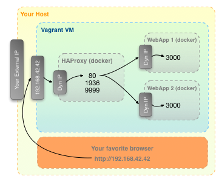
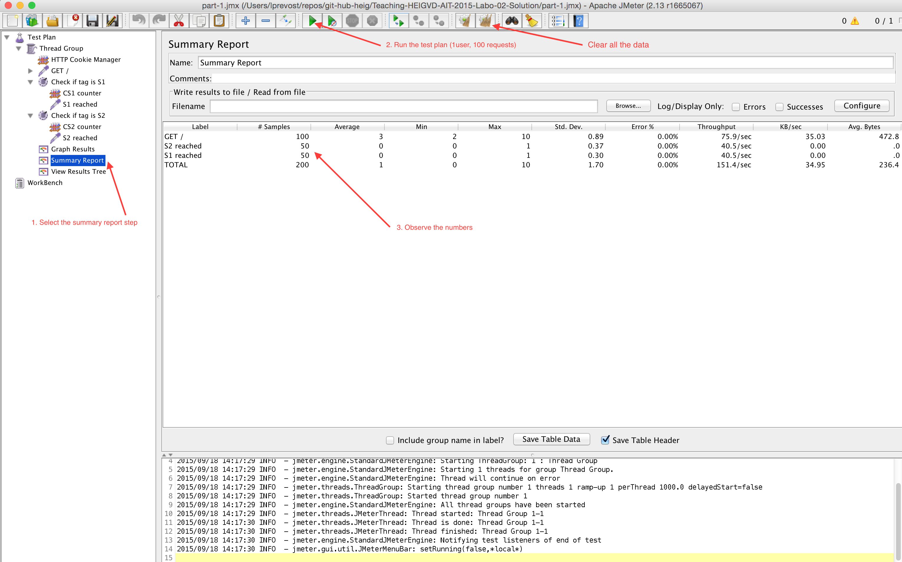
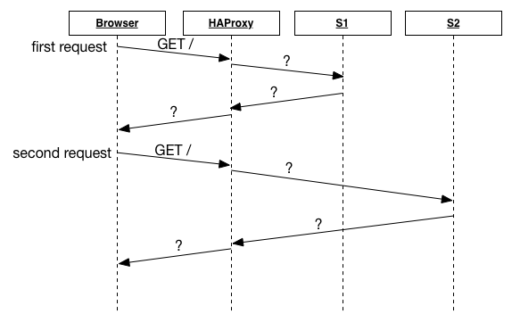
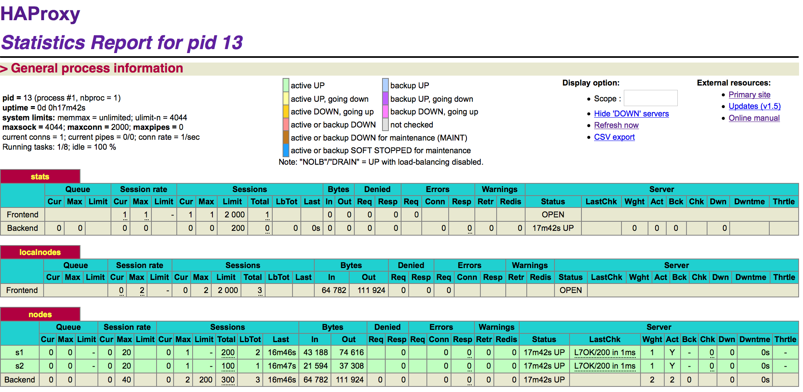

title: Lab 03 - Load balancing
---

## Lab 03 - Load balancing


#### Pedagogical objectives

* Deploy a web application in a two-tier architecture for scalability

* Configure a load balancer

* Performance-test a load-balanced web application

In this lab you will perform a number of tasks and document your
progress in a lab report. Each task specifies one or more deliverables
to be produced.  Collect all the deliverables in your lab report. Give
the lab report a structure that mimics the structure of this document.

**Remark**: Use the Task numbers and question numbers in reference in your report.

### Task 1: Install the tools

In this part you will install the base tools you need to do the
different tasks of this lab.

Install on your local machine Vagrant to create a virtual
environment. We provide scripts for installing and running inside this
virtual environment Docker. Install also JMeter for load testing web
applications:

* [Vagrant](https://www.vagrantup.com/)
* [JMeter](http://jmeter.apache.org/)

Clone the following repository to your machine:
<https://github.com/SoftEng-HEIGVD/Teaching-HEIGVD-AIT-2015-Labo-02>

Once you have installed everything, start the Vagrant VM from the
project folder with the following command:

```bash
$ vagrant up
```

This will download an Ubuntu Linux image and initialize a Vagrant
virtual machine with it. Vagrant then runs a provisioning script
inside the VM that installs Docker and creates three Docker
containers. One contains HAProxy, the other two contain each a sample
web application.

The containers with the web application stand for two web servers that
are load-balanced by HAProxy.

The provisioning of the VM and the containers will take several
minutes. You should see output similar to the following:

```bash
$ vagrant up
Bringing machine 'default' up with 'virtualbox' provider...
==> default: Importing base box 'phusion/ubuntu-14.04-amd64'...
==> default: Matching MAC address for NAT networking...
==> default: Checking if box 'phusion/ubuntu-14.04-amd64' is up to date...
[...]
==> default: Removing intermediate container 4a23f3ea2a27
==> default: Successfully built 69388325f98a
==> default: ************************  run webapps  ************************
==> default: 3fb984306e36090f18e9da5b86c32d2360ad7768a0ab11dff7f9b588c2869e4a
==> default: c845c95bfb48d67625d67367a1a12226a6d35269d26ec452c90b0fd095a29d28
==> default: ************************  run haproxy  ************************
==> default: 5882839613b57e8b97737787a33678116237a80e0643cdd13fb34ac5f9e7d22b
```
    
There will be occasional error messages from `dpkg-preconfigure`,
`debconf` or `invoke-rc.d`. You can safely ignore them.

When deployment is finished you can log into the VM like so:

    $ vagrant ssh

Once inside the VM you can list the running containers like so:

    $ docker ps

You should see output similar to the following:

    CONTAINER ID        IMAGE                  COMMAND             CREATED             STATUS              PORTS                                                                NAMES
    2b277f0fe8da        softengheigvd/ha       "./run.sh"          21 seconds ago      Up 20 seconds       0.0.0.0:80->80/tcp, 0.0.0.0:1936->1936/tcp, 0.0.0.0:9999->9999/tcp   ha
    0c7d8ff6562f        softengheigvd/webapp   "./run.sh"          22 seconds ago      Up 21 seconds       3000/tcp                                                             s2
    d9a4aa8da49d        softengheigvd/webapp   "./run.sh"          22 seconds ago      Up 21 seconds       3000/tcp                                                             s1

The two web app containers stand for two web servers. They run a
NodeJS sample application that implements a simple REST API. Each
container exposes TCP port 3000 to receive HTTP requests.

The HAProxy load balancer is listening on TCP port 80 to receive HTTP
requests from users. These requests will be forwarded to and
load-balanced between the web app containers. Additionally it exposes
TCP ports 1936 and 9999 which we will cover later.

The architecture of our distributed web application is shown in the
following diagram:



You can now navigate to the address of the load balancer
<http://192.168.42.42> in your favorite browser. The load balancer
forwards your HTTP request to one of the web app containers. 

Both containers run the same simple test web app. It is modeled as a
REST resource. To make this lab more "interesting" the app uses
sessions. The app is written in Node.js and uses a cookie named
`NODESESSID`.

The app returns an HTTP response with a JSON payload that is designed
to help you with testing and debugging. You should see output similar
to the following:

```json
{
  "hello": "world!",
  "ip": "172.17.0.7",
  "host": "2b277f0fe8da",
  "tag": "s1",
  "sessionViews": 1,
  "id": "pdoSpuStaotzO4us2l_uYArG0w6S57eV"
}
```

The fields have the following meaning:

* The field `ip` contains the internal IP address of the
  container. This allows you to identify the container, as each
  receives a different IP address from Docker.

* The field `host` is the hostname of the container and in the Docker
  context this represents the container ID.

* The `tag` represents the server tag corresponding, in our case, to
  the container name (docker **--name s1**).

* The field `sessionViews` returns a counter that is a session
  variable. The counter is incremented each time the app receives a
  request.  **Hint**: Use this field to observe the session behavior
  of the load balancer.

* Finally, the field `id` is the session id. You should be able to
  find that same session id embedded in the session cookie that is
  sent to the client.

Now it's time to play a bit with what we did until now.

Open JMeter and then open the script `tester.jmx` present in the root
folder of the project and follow the instructions given in the
following screenshot (Click on the image and then on RAW button to see the picture in full size. Usefull to read the text):



The JMeter test plan is set up in the following way:

* A Thread Group simulates one user making one hundred GET requests to
  <http://192.168.42.42/>.

* An HTTP Cookie Manager is active on the Thread Group that will send
  back in the HTTP request any cookies received in previous responses.

* The server tag is extracted from the HTTP response and used for two
  counters, CS1 and CS2, that are incremented each time the reponse
  came from web app S1 or S2, respectively.

* The Summary Report shows the counters ("S1 reached" / "S2 reached")
  and the total counts.


**Deliverables:**

1. Explain how the load balancer behaves when you open and refresh the
  URL <http://192.168.42.42> in your browser. Add screenshots to
  complement your explanations. We expect that you take a deeper a
  look at session management.
  
2. Explain what should be the correct behavior of the load balancer for
  session management.

3. Provide a sequence diagram to explain what is happening when one
  requests the URL for the first time and then refreshes the page. We
  want to see what is happening with the cookie. We want to see the
  sequence of messages exchanged (1) between the browser and HAProxy
  and (2) between HAProxy and the nodes S1 and S2. Here is an example:
  
  

4. Provide a screenshot of the summary report from JMeter.

5. In the Vagrant VM, run the following command:

  ```bash
  $ docker stop s1
  ```
  
  Clear the results in JMeter and re-run the test plan. Explain what
  is happening when only one node remains active. Provide another
  sequence diagram using the same model as the previous one.


### Task 2: Sticky sessions

It's time to go further. At this stage, we now have a load balanced
web application but the session management is totally messed up. In
this task your job is to fix the configuration of HAProxy to enable
sticky session management.

For that, you will have to play with docker a little bit more. You
might want to consult the file `Docker quick reference.md` for some
useful commands and hints.

**Deliverables:**

1. There is different way to implement the sticky session. One possibility is to use the SERVERID provided by HAProxy. Another way is to use the NODESESSID provided by the application. Briefly explain the difference between both approaches (provide a sequence diagram with cookies to show the difference).

  * Choose one of the both stickiness approach for the next tasks.

2. Provide the modified `haproxy.cfg` file with a short explanation of
  the modifications you did to enable sticky session management.

3. Explain what is the behavior when you open and refresh the URL
  <http://192.168.42.42> in your browser. Add screenshots to
  complement your explanations. We expect that you take a deeper a
  look at session management.
  
4. Provide a sequence diagram to explain what is happening when one
  requests the URL for the first time and then refreshes the page. We
  want to see what is happening with the cookie. We want to see the
  sequence of messages exchanged (1) between the browser and HAProxy
  and (2) between HAProxy and the nodes S1 and S2. We also want to see
  what is happening when a second browser is used.

5. Provide a screenshot of JMeter's summary report. Is there a
  difference with this run and the run of Task 1?

  * Clear the results in JMeter.

  * Now, update the JMeter script. Go in the HTTP Cookie Manager and
  <del>uncheck</del><ins>verify that</ins> the box `Clear cookies each iteration?`
  <ins>is unchecked</ins>.

6. Provide a screenshot of JMeter's summary report. This time, is there
  a difference with this run and the run of Task 1?

  * Once again, update the JMeter script. Go in `Thread Group` and
  update the `Number of threads`. Set the value to 2.

7. Provide a screenshot of JMeter's summary report. Give a short
  explanation of what the load balancer is doing.


### Task 3: Drain mode

HAProxy provides a mode where we can set a node to DRAIN state. In
this case, HAProxy will let _current_ sessions continue to make
requests to the node in DRAIN mode and will redirect all other traffic
to the other nodes.

In our case, it means that if we put `s1` in DRAIN mode, all new
traffic will reach the `s2` node and all current traffic directed to
`s1` will continue to communicate with `s1`.

Another mode is MAINT mode which is more intrusive than DRAIN. In this
mode, all current and new traffic is redirected to the other active
nodes even if there are active sessions.

In this task, we will experiment with these two modes. We will base
our next steps on the work done on Task 2. We expect you have a
working Sticky Session configuration with two web app nodes up and
running called `s1` and `s2`.

When all the infra is up and running, perform the following steps:

1. Open a browser on your host

2. Navigate to `http://192.168.42.42`. You will reach one of the two
   nodes. Let's assume it is `s1` but in your case, it could be `s2`
   as the balancing strategy is roundrobin.

3. Refresh the page. You should get the same result except that the
   views counter is incremented.

4. Refresh multiple times the page and verify that you continue to
   reach the same node and see the sessionViews counter increased.

5. In a different tab, open `http://192.168.42.42:1936` and take a
   look. You should have something similar to the following
   screenshot.



  You should be able to see the `s1` and `s2` nodes and their state.
  
For the next operations, you will use HAProxy's built-in command line
to query its status and send commands to it. HAProxy provides the
command line via a TCP socket so that a system administrator is able
to connect to it when HAProxy runs on a remote server. You will use
`socat` to connect to the TCP socket. `socat` is a universal
command-line tool to connect pretty much anything with anything. The
tool is already installed in the Vagrant VM and therefore you do not
need any additional install on your host.

To use it, log into the Vagrant VM via ssh (`vagrant ssh`) and then
type the following:

```bash
$ socat - tcp:localhost:9999
prompt

> help
Unknown command. Please enter one of the following commands only :
  clear counters : clear max statistics counters (add 'all' for all counters)
  clear table    : remove an entry from a table
  help           : this message
  prompt         : toggle interactive mode with prompt
  quit           : disconnect
  show info      : report information about the running process
[...]
```

After typing `socat - tcp:localhost:9999` and pressing enter you will
see... nothing. You are connected to HAProxy, but it remains silent
for the time being. You have to turn on the prompt by typing
`prompt`. You will see a new line starting with `>`. Now you can enter
commands that will be directly interpreted by HAProxy.

First, increase the client timeout to avoid losing connections.

```bash
> set timeout cli 1d
```

Now, to set a node's state to `ready`, `maint` or `drain`, enter the
following command:

```bash
> set server nodes/<containerName> state <state>
```

**Note:** In fact, the `nodes` is the group of backend nodes
  labelled. You will find the corresponding `backend nodes` in ha
  config.

**Note 2:** The containerName is the label of the node. In fact, in
this lab, we used the same name as Docker container names but both
names are not linked together. We can choose different names if we
want. The name set in this command is the name present in the HAProxy
admin stats interface (or also found in the config file).

**Note 3:** We will use only the three states presented there. Take
  care that the command only accept lower cases states.

**Deliverables:**

* Take a screenshot of the Step 5 and tell us which node is answering.

* Based on your previous answer, set the node in DRAIN mode. Take a
  screenshot of the HAProxy state page.

* Refresh your browser and explain what is happening. Tell us if you
  stay on the same node or not. If yes, why? If no, why?

* Open another browser and open `http://192.168.42.42`. What is
  happening?

* Clear the cookies on the new browser and repeat these two steps
  multiple times. What is happening? Are you reaching the node in
  DRAIN mode?

* Reset the node in READY mode. Repeat the three previous steps and
  explain what is happening. Provide a screenshot of HAProxy's stats
  page.

* Finally, set the node in MAINT mode. Redo the three same steps and
  explain what is happening. Provide a screenshot of HAProxy's stats
  page.


### Task 4: Balancing strategies

In this part of the lab you will discover the different strategies of
HAProxy to load balance the traffic between the nodes.

You can discover the different strategies in
[HAProxy documentation](http://cbonte.github.io/haproxy-dconv/configuration-1.6.html#balance)

To help viewing the difference between strategies, the web application
has a REST resource to configure a delay in the response. You can set
an arbitrary delay in milliseconds. Once the delay is configured, the
response will take the amount of time configured.
 
To set the timeout, you have to do a `POST` request with the following
content (be sure the `Content-Type` header is set to
`application/json`. The configuration is applicable on each
node. Therefore, you can do one `POST` request on
`http://192.168.42.42/delay` and taking a look at the response cookies
will tell you which node has been configured.

```json
{
  "delay": 1000
}
```

The previous example will set a delay of 1 second.

Or from the Vagrant VM, retrieve the IP of the container you want to
configure and then do the `curl` command to configure the delay.

```bash
$ docker inspect --format '{{ .NetworkSettings.IPAddress }}' <containerName>

$ curl -H "Content-Type: application/json" -X POST -d '{"delay": 1000}' http://<containerIp>:3000/delay
```

To reset the delay configuration, just do a `POST` with 0 as the delay
value.

Prepare your JMeter script with cookies erased (this will simulate new
clients for each requests) and 10 threads this will simulate 10
concurrent users.

*Remark*: In general, take a screenshot of the summary report in
 JMeter to explain what is happening.

**Deliverables:**

* Based on the previous step, run the JMeter script to have the base
  data set to compare with the other strategies. Take a screenshot of
  the summary report.

* Set a delay of 2500 milliseconds on `s1`. Relaunch a run with the
  JMeter script and explain what it is happening?

* Set a delay of 250 milliseconds on `s1`. Same than previous step.

* In the two previous steps, are there any error? Why?

* Update the HAProxy configuration to add a weight to your nodes. For
  that, add `weight [1-256]` where the value of weight is between the
  two values (inclusive). Set `s1` to 2 and `s2` to 1. Redo the three
  first steps.

* Now, change your HAProxy configuration file to remove the weight
  (for the moment) and change the balancing strategy. Use the `first`
  strategy. Reset the web apps to have no delay. Clear the JMeter
  results.

* Do a JMeter run and explain what is happening.

* Set a delay of 250 milliseconds on `s1` and redo the JMeter run. Explain what is happening.

* Once again, reset the JMeter results and make sure your
  configuration file is ready to change for the `leastconn` strategy.

* Do a new JMeter run with this strategy and explain what is
  happening. Is there another strategy that looks similar? If yes,
  which one?

* Set the delay to `s1` at 250 milliseconds and redo a JMeter
  run. What do you observe?

* Redo all the previous step but configure JMeter to not clear the
  cookies between each iterations. Compare:
  
  * `roundrobin` with/without cookies erased
  * `first` with/without cookies erased
  * `leastconn` with/without cookies erased
  
* Make a general comparison, in your own opinion, about the three
  strategies used there. Read the documentation to understand the
  differences.

* Finally, for the purpose of this lab, which is the best strategy for
  the case where both web application are 100% up and ready?

#### References

* [HAProxy Socket commands (drain, ready, ...)](https://cbonte.github.io/haproxy-dconv/configuration-1.5.html#9.2-set%20server)
* [Socat util to run socket commands](http://www.dest-unreach.org/socat/)
* [Socat command examples](https://stuff.mit.edu/afs/sipb/machine/penguin-lust/src/socat-1.7.1.2/EXAMPLES)

#### Lab due date

Deliver your results at the latest 15 minutes before class Wednesday, November 25.

#### Windows troubleshooting

It appears that Windows users can encounter a `CRLF` vs. `LF` problem when the repos is cloned without taking care of the ending lines. Therefore, if the ending lines are `CRFL`, it will produce an error message with Docker during the Vagrant provisioning phase:

```bash
... no such file or directory
```

(Take a look to this Docker issue: https://github.com/docker/docker/issues/9066, the last post show the error message).

The error message is not really relevant and difficult to troubleshoot. It seems the problem is caused by the line endings not correctly interpreted by Linux when they are `CRLF` in place of `LF`. The problem is caused by cloning the repos on Windows with a system that will not keep the `LF` in the files.

Fortunatelly, there is a procedure to fix the `CRLF` to `LF` and then be sure Docker will recognize the `*.sh` files.

First, you need to add the file `.gitattributes` file with the following content:

```bash
* text eol=lf
```

This will ask the repos to force the ending lines to `LF` for every text files.

Then, you need to reset your repository. Be sure you do not have **modified** files.

```bash
# Erease all the files in your local repository
git rm --cached -r .

# Restore the files from your local repository and apply the correct ending lines (LF)
git reset --hard
```

Then, you are ready to go. You can provision your Vagrant VM again and start to work pacefully.

There is a link to deeper explanation and procedure about the ending lines writtent by GitHub: https://help.github.com/articles/dealing-with-line-endings/
